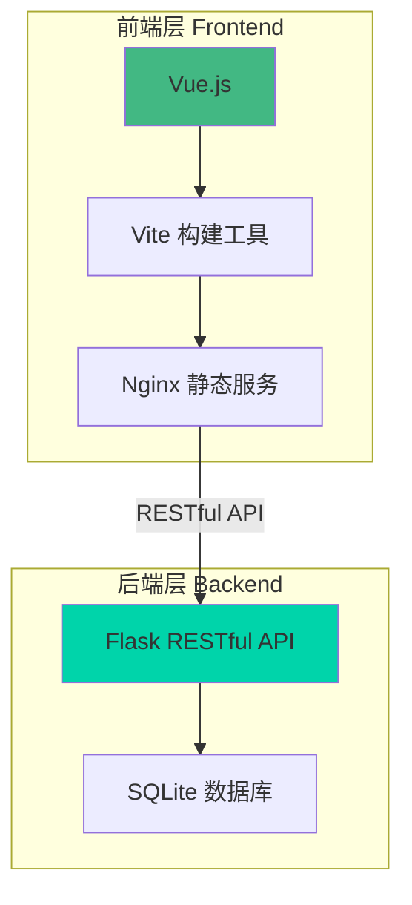
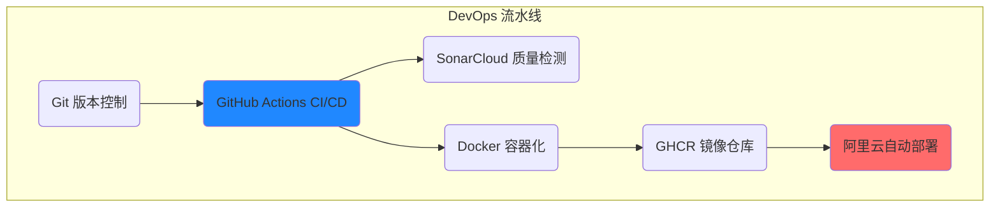

# Blog 技术部分

这是一个武大大一学生的第三学期项目，前端基于vue框架，后端基于flask框架，数据库采用sqlite，虽然代码基本都是ai写的，但是仍然是一个全栈 + DevOps的成功尝试

## 前后端分离架构



## 技术栈详解

| 分层 | 技术选型 | 职责说明 |
|------|---------|----------|
| **前端表现层** | Vue.js + Vite | 用户界面，单页应用，组件化开发 |
| **前端构建** | Vite + ESLint | 现代化构建工具，快速热重载 |
| **Web服务器** | Nginx | 静态资源服务，反向代理，负载均衡 |
| **后端API层** | Python Flask | RESTful API设计，业务逻辑处理 |
| **数据持久层** | SQLite | 轻量级关系型数据库，ACID事务 |
| **容器化** | Docker + Compose | 应用容器化，环境隔离，依赖管理 |
| **CI/CD** | GitHub Actions | 持续集成，自动化部署流水线 |
| **代码质量** | SonarCloud | 静态代码分析，安全漏洞检测 |
| **镜像仓库** | GitHub Container Registry | 容器镜像版本管理，分发 |
| **API测试** | Apifox | 测试API的健壮性 |

## CI/CD流程



Git + GitHub + Docker + SonarCloud + GitHub Actions + 阿里云服务器（只租了一个月）

欢迎访问我们项目的公网IP：http://47.97.166.247 

```
代码修改 → git push → GitHub Actions → SonarCloud代码质量检查 → Dockerfile构建
                                                                    ↓
服务器 ← docker-compose up ← docker-compose pull ← GHCR镜像仓库 ← 镜像推送GHCR
```

## 如何部署我们的博客

### 系统要求

- Windows 10/11
- Docker Desktop 已安装并运行
- 网络连接

### 想体验这个项目..  快速部署

1. **下载部署包**
	- 下载blog-deployment文件夹
2. **运行部署脚本**
	- 双击 `deploy.bat`
	- 等待下载和启动完成
3. **访问应用**
	- 前端：http://localhost
	- 后端：http://localhost:5000
4. 镜像缓存机制
	+ 应用已经构造并上传到GHCR
	+ 所有依赖都打包在镜像里
	+ 不需要重新编译、安装依赖
	+ 所以我们的部署会非常迅速
5. 清理应用
	+ 双击 `cleanup.bat` 完全移除应用

### 服务器部署

服务器只需要拉取镜像

```
# 在服务器执行
docker-compose pull  # 拉取预构建的镜像
docker-compose up -d  # 直接运行，无需构建
```

可见`docker + ghcr`的部署解决方案给服务器和个人部署都提供了便利。

## 支持

如有问题，请添加我的qq：[624464134]

## 部署信息

已成功部署到阿里云轻量应用服务器：
- **服务器IP**：47.97.166.247
- **操作系统**：Ubuntu 20.04
- **运行状态**：24/7在线
- **部署方式**：Docker + Docker Compose

---